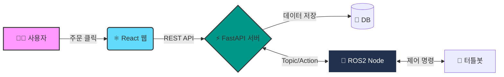

# 🤖 ROS2 기반 자율주행 로봇 통합 관제 플랫폼

> **"웹에서 클릭 한 번으로, 로봇이 현실 세계를 움직입니다."**
> 사용자가 웹으로 물품을 주문하면, 자율주행 로봇이 스스로 경로를 찾아 배달하는 **O2O(Online to Offline) 통합 관제 시스템**입니다.

<br>

## 🛠 기술 스택 (Tech Stack)

### 🎨 Frontend


### ⚡ Backend & Database


### 🤖 Robotics & OS


<br>

## 🏛 시스템 아키텍처 (Architecture)


## 🚀 주요 기능 (Key Features)

### 1️⃣ 실시간 로봇 관제 대시보드 (Real-time Dashboard)
* **기능:** 웹 브라우저에서 다중 로봇의 **위치, 배터리 상태, 작업 현황**을 실시간으로 확인.
* **구현:**
  * `FastAPI` 백엔드에서 ROS2 토픽(`/odom`, `/battery_state`)을 구독(Sub).
  * `React` 프론트엔드가 0.5초 주기로 API를 폴링하여 데이터를 시각화.

### 2️⃣ 원스톱 주문 및 자동 배차 (Order & Dispatch)
* **기능:** 사용자가 물품을 주문하면, 시스템이 가용 로봇을 찾아 **자율주행 명령**을 전송.
* **구현:**
  * 사용자 주문(REST API) → DB 재고 차감 (MySQL) → ROS2 Action (`MapsToPose`) 전송.
  * 주문 실패 시 예외 처리 및 트랜잭션 롤백 구현.

### 3️⃣ AI 기반 CCTV 위험 감지 (AI Safety Zone)
* **기능:** 작업 구역에 사람이 감지되면 로봇 진입을 차단하거나 경고 발생.
* **구현:**
  * **YOLOv8** 모델을 활용하여 CCTV 영상 내 객체 인식.
  * ROI(관심 구역) 내 사람/로봇 감지 시 `Warning` 토픽 발행.

<br>

## 🔥 기술적 도전 및 해결 (Troubleshooting)

### 🛑 Issue 1: FastAPI와 ROS2의 동시성 충돌
* **문제:** `FastAPI`(비동기 웹 서버)와 `rclpy.spin()`(동기식 ROS 루프)을 하나의 프로세스에서 실행하자, **메인 스레드가 차단(Blocking)되어 웹 서버가 먹통이 되는 현상** 발생.
* **해결 (Solution): Python Multi-threading 적용**
  * `FastAPI` 실행 시 `Startup Event`를 활용하여 ROS2 통신 노드를 **별도의 데몬 스레드(Daemon Thread)**로 분리.
  * 이를 통해 웹 서버의 응답성을 유지하면서도, 백그라운드에서 로봇 데이터를 끊김 없이 수신하는 **이중 구조**를 완성함.
  * *관련 코드: `backend/main.py` 내 `threading.Thread(target=ros_spin).start()`*

### 📉 Issue 2: 실시간 데이터 동기화 지연
* **문제:** 로봇은 움직이는데 웹 화면의 반영 속도가 느려 사용자 경험(UX) 저하.
* **해결 (Solution): 인메모리 캐싱 & 상태 관리 최적화**
  * DB 조회를 최소화하고, 빈번하게 변하는 센서 데이터는 파이썬 전역 변수(Global Dict)에 **인메모리 캐싱**.
  * 프론트엔드 폴링 주기를 최적화하고, 데이터 변경이 있을 때만 렌더링하도록 React 상태 관리 로직 개선.

<br>

## 📂 폴더 구조 (Project Structure)

```bash
📦 Project_Root
 ┣ 📂 backend           # FastAPI 서버 및 ROS2 노드
 ┃ ┣ 📜 main.py         # 서버 진입점 (FastAPI + ROS Thread)
 ┃ ┣ 📜 ros_node.py     # 로봇 제어 노드 (Publisher/Subscriber)
 ┃ ┣ 📜 order_node.py   # 로봇에게 주문 명령을 전송하는 노드
 ┃ ┗ 📜 schemas.py      # Pydantic 데이터 모델 (요청/응답 규격)
 ┣ 📂 cctv              # CCTV 객체 탐지 모델
 ┃ ┗ 📜 best.pt         # YOLOv8 학습 모델 (ROI 내 로봇/사람 탐지)
 ┗ 📂 frontend          # React 웹 애플리케이션
   ┗ 📂 src
     ┗ 📂 pages         # 화면 단위 페이지 컴포넌트
       ┣ 📜 LoginPage.js      # 로그인 페이지
       ┣ 📜 MainPage.js       # 메인 대시보드
       ┣ 📜 OrderPage.js      # 주문 및 배차 페이지
       ┣ 📜 RobotStatusPage.js # 로봇 상태 모니터링 페이지
       ┣ 📜 App.js        # 페이지 라우팅(경로) 설정
       ┣ 📜 index.js      # 앱 진입점 및 렌더링
       ┗ 📜 App.css       # 전체 레이아웃 및 스타일
```
